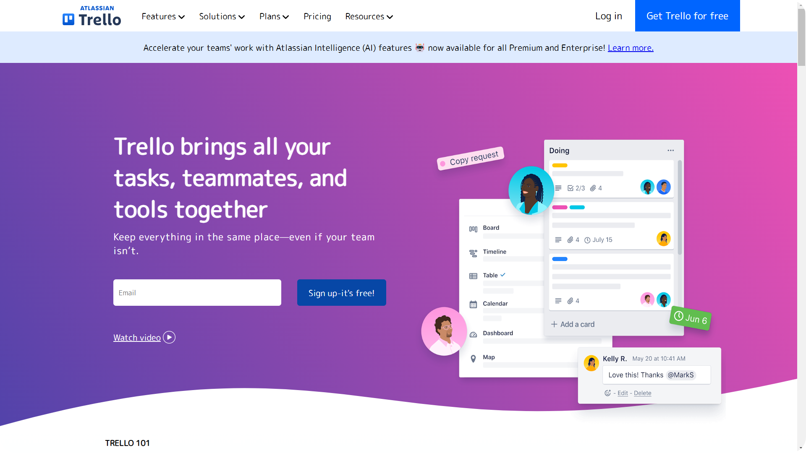

# 📌 Trello Clone

## 📝 Introduction
This is a **Trello Clone** built using only **HTML & CSS** as a practice project to enhance my frontend development skills. The goal of this project was to improve my understanding of layouts, positioning.

## 📸 Visual Preview



## 🛠️ User Instructions
1. **Clone the repository**
   ```sh
   git clone https://github.com/Abuthahir-chalissery/Trello.git
   ```
2. **Navigate to the project folder**
   ```sh
   cd Trello
   ```
3. **Open `index.html` in a browser**
   ```sh
   Open index.html
   ```
4. **Explore the Features**
   - List and card layout similar to Trello

## ❌ Mistakes I Made
- Initially struggled with understanding **layouts and positioning**.


## 🎯 Lessons I Learned
- Improved skills in **structuring and aligning divs properly**.
- Learned to create **scalable and maintainable layouts**.


## 📬 Contact
For any queries or suggestions, feel free to reach out:
📧 Email: abuthahirchalissery162@gmail.com

---


